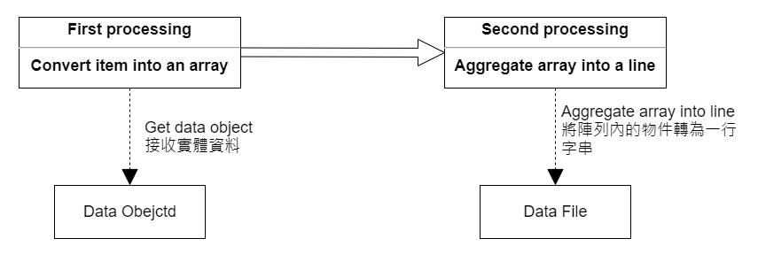

# 07 - 建立 FlatFileItemWriter 與 ItemWriterListener

## ItemWriter
ItemWriter 在功能上與 ItemReader 相似，但具有相反的作用，負責資料的寫出。在 Database 或是 Queue 的情況下，這些操作可能是插入、更新或是發送。較常使用的 ItemWriter 類別有 `FlatFileItemWriter`、`RepositoryItemWriter`、`JdbcBatchItemWriter` 等等。其他 ItemWriter 的類別可以參考 https://docs.spring.io/spring-batch/docs/current/reference/html/appendix.html#itemWritersAppendix。
```java
public interface ItemWriter<T> {

    void write(List<? extends T> items) throws Exception;

}
```

## FlatFileItemWriter
Spring Batch 的讀取和寫入資料來源比較常見的有這三種：XML、Database 及 Flat File。最常用的寫入檔案的 ItemWriter 是 FlatFileItemWriter。FlatFile 是**扁平結構檔案** ( 也稱為矩陣結構檔案 )，是最常見的一種檔案型別。與 JSON、XML 檔案的差別在於 FlatFile 沒有一個特定的結構，所以在讀取的時候需要定義讀取及轉換的規則。

一般來說，輸出平面文件可以分成兩種切割方式：
1. `delimited`：以某個特殊符號或規則劃分
2. `fixed length`：以長度劃分

寫入時通常會將一個 Data Object 轉成一行 ( line )，同一行資料的欄位之間可以用某種方式分隔。如果是 `delimited` 的話，比較常見的分隔符號有分號 `;`、逗號 `,` 等等。若是以長度劃分的話，就要在程式內設定每個欄位的長度。

## LineAggregator
`LineAggregator` 是 FlatFileItemWriter 中實際處理資源的一個角色，與後面提到的 `LineTokenizer` 功能類似。在撰寫 FlatFileItemWriter 時，首先要提供 `Resource` 告訴它文件要產在哪，再來就是要通過 `LineAggregator` 對象處理資源，這時候會需要提供一個  ( 分隔符 ) 來告訴它如何將將 Data Object 轉換為 String，也就是將 Data Object 中的所有屬性聚合成一個 String 以寫入文件。

如果從 Process 回傳的物件本身就是 String 物件，就不需要特別做處理，像是下方提到的 `PassThroughLineAggregator`；但如果回傳的是一個 Entity 或是 DTO 的話，通常會使用 `DelimitedLineAggregator` 並告訴他 Data Object 內的屬性應該如何 mapping。

```java
public interface LineAggregator<T> {

    public String aggregate(T item);

}
```

`LineTokenizer` 則是反向的將一串 String 拆解為不同的字段，傳入一段 String 並輸出 `FieldSet`，最後塞到 Data Object 中。`LineAggregator` 則是傳入一個 `item`，`item` 可以是任何行別，通常會傳入 Data Object 的型別，最後回傳 String。

#### PassThroughLineAggregator
實現 `LineAggregator` 最基本的類別是 `PassThroughLineAggregator`，它會預設傳入的物件的每一個屬性是可以使用 `toString()` 方法直接轉換為 String 物件的：
```java
public class PassThroughLineAggregator<T> implements LineAggregator<T> {

    public String aggregate(T item) {
        return item.toString();
    }
}
```

所以使用此類別作為 `LineAggregator` 時可以不需要提供 `FieldExtractor`。

#### DelimitedLineAggregator
用在傳入 Writer 的物件是一個 Entity 或是 DTO 這種屬性有不同型別的情況。由於並非所有類別的 `toString()` 都可以取到字面值，這時候就需要使用 `DelimitedLineAggregator` 來定義他們之間該如何轉換為 String。

`DelimitedLineAggregator` 內部依賴 `FieldExtractor` 物件將 Data Object 轉換成一行 String。

## FieldExtractor
`FieldExtractor` 用於將實體類別到 Collection 結構的轉換。轉換的步驟大致如下：<br/>



1. 首先 Writer 會接收要輸出的資料 ( item )
2. 將實體類別中的 field 轉換到陣列集合中
3. 將集合內的結果轉換為一行輸出

由於框架不知道那些 fields 要被如何轉換或輸出，所以在設定 `FieldExtractor` 必須實作 `extract()` 方法。

```java
public interface FieldExtractor<T> {

    Object[] extract(T item);

}
```

#### BeanWrapperFieldExtractor
一般而言，最快速的方法是使用 `PassThroughFieldExtractor` 或是 `BeanWrapperFieldExtractor`，而不是自行編寫轉換邏輯。這邊只提到 `BeanWrapperFieldExtractor`，更多 `FieldExtractor` 可以參考官方文件。示意如下：
```java
BeanWrapperFieldExtractor<Name> extractor = new BeanWrapperFieldExtractor<>();
extractor.setNames(new String[] { "first", "last", "born" });

String first = "Alan";
String last = "Turing";
int born = 1912;

Name n = new Name(first, last, born);
Object[] values = extractor.extract(n);

assertEquals(first, values[0]);
assertEquals(last, values[1]);
assertEquals(born, values[2]);
```

> This is a field extractor for a java bean. Given an array of property names, it will reflectively call getters on the item and return an array of all the values.

`BeanWrapperFieldExtractor` 適用於物件實體的轉換，使用時必須先給定一個 String 陣列，裡面設定每個屬性的名稱，執行時期就會依照給定的名稱映射，呼叫對應屬性的 `getter()` 方法。String 陣列內欄位名稱的順序會影響映射的結果。

最後總結一下 FlatFileItemWriter 的結構與關係，如下圖。<br/>


其中 `FlatFileHeaderCallback` 與 `FlatFileFooterCallback` 用於撰寫表頭表尾。<br/>


## 建立 ItemWriter
接下來在 `DbReaderJobConfig.java` 中新增 ItemWriter 相關設定。
```
spring.batch.springBatchExample.job
  |--DbReaderJobConfig.java // 修改
spring.batch.springBatchExample.listener 
  |--Db001JobListener.java
  |--Db001StepListener.java
  |--Db001ReaderListener.java
```

* `DbReaderJobConfig.java`
```java
@Configuration
public class DbReaderJobConfig {

	/** JobBuilderFactory */
	@Autowired
	private JobBuilderFactory jobBuilderFactory;

	/** StepBuilderFactory */
	@Autowired
	private StepBuilderFactory stepBuilderFactory;

	/** CarRepo */
	@Autowired
	private CarsRepo carRepo;

	/** 每批件數 */
	private static int FETCH_SIZE = 10;
	
	/** Mapper Field */
	private static final String[] MAPPER_FIELD = new String[] { "Manufacturer", "Type", "MinPrice", "Price" };

	/** Header */
	private final String HEADER = new StringBuilder().append("製造商").append(',').append("類別").append(',').append("底價").append(',')
			.append("售價").toString();

	/**
	 * 建立 Job
	 * 
	 * @param step
	 * @return
	 */
	@Bean
	public Job dbReaderJob(@Qualifier("Db001Step") Step step) {
		return jobBuilderFactory.get("Db001Job")
				.start(step)
				.listener(new Db001JobListener())
				.build();
	}

	/**
	 * 建立 Step
	 * 
	 * @param itemReader
	 * @param itemWriter
	 * @param transactionManager
	 * @return
	 */
	@Bean("Db001Step")
	public Step dbReaderStep(@Qualifier("Db001JpaReader") ItemReader<Cars> itemReader, @Qualifier("Db001FileWriter") ItemWriter<Cars> itemWriter,
			JpaTransactionManager transactionManager) { // 加入

		return stepBuilderFactory.get("Db001Step")
				.transactionManager(transactionManager)
				.<Cars, Cars>chunk(FETCH_SIZE)
				.faultTolerant()
				.skip(Exception.class)
				.skipLimit(Integer.MAX_VALUE)
				.reader(itemReader)
				.writer(itemWriter) // 加入
				.listener(new Db001StepListener())
				.listener(new Db001ReaderListener())
				.build();
	}

	/**
	 * 建立 Jpa Reader
	 * 
	 * @return
	 */
	@Bean("Db001JpaReader")
	public RepositoryItemReader<Cars> itemReader() {

		Map<String, Direction> sortMap = new HashMap<>();
		sortMap.put("Manufacturer", Direction.ASC);
		sortMap.put("Type", Direction.ASC);

		return new RepositoryItemReaderBuilder<Cars>()
				.name("Db001JpaReader")
				.pageSize(FETCH_SIZE)
				.repository(carRepo)
				.methodName("findAll")
				// .arguments(args)
				.sorts(sortMap) // 必要
				.build();
	}

	/**
	 * 建立 File Writer
	 * @return
	 */
	@Bean("Db001FileWriter")
	public FlatFileItemWriter<Cars> customFlatFileWriter() {

        String fileName = new SimpleDateFormat("yyyyMMddHHmmssS").format(new Date());

		BeanWrapperFieldExtractor<Car> fieldExtractor = new BeanWrapperFieldExtractor<>();
		fieldExtractor.setNames(MAPPER_FIELD);

		DelimitedLineAggregator<Car> lineAggreagor = new DelimitedLineAggregator<>();
		lineAggreagor.setFieldExtractor(fieldExtractor);

		return new FlatFileItemWriterBuilder<Cars>().name("Db001FileWriter")
				.encoding("UTF-8")
				.resource(new FileSystemResource("D:/" + fileName + ".csv"))
				.append(true) // 是否串接在同一個檔案後
				.lineAggregator(lineAggreagor)
				.headerCallback(headerCallback -> headerCallback.write(HEADER)) // 使用 headerCallback 寫入表頭
				.build();
	}
}
```

* `encoding()`：設定輸出檔案編碼
* `resource()`：指定輸出檔案位置與檔名，傳入 `Resource` 對象
* `append()`：每一筆輸出的資料是否要接在同一個檔案後，不分割檔案
* `lineAggregator()`：傳入 LineAggregator 物件
* `headerCallback()`：寫入匯出檔案的表頭

## 建立 ItemWriterListener
```
spring.batch.springBatchExample.job
  |--DbReaderJobConfig.java // 修改
spring.batch.springBatchExample.listener 
  |--Db001obListener.java
  |--Db001StepListener.java
  |--Db001ReaderListener.java
  |--Db001WriterListener.java // 新增
```

* `Db001WriterListener.java`
```java
public class Db001WriterListener implements ItemWriteListener<CarsDto> {
    
    private static final Logger LOGGER = LoggerFactory.getLogger(Db001WriterListener.class);

    @Override
    public void beforeWrite(List<? extends CarsDto> items) {
        LOGGER.info("寫入資料開始");
    }

    @Override
    public void afterWrite(List<? extends CarsDto> items) {
        LOGGER.info("寫入資料結束");
    }

    @Override
    public void onWriteError(Exception ex, List<? extends CarsDto> items) {
        LOGGER.error("Db001Writer: 寫入資料失敗", ex);
    }

}
```
<br/>

再來一樣將 Listener 設定到 Step。
* `DbReaderJobConfig.java`
```java
/**
 * 建立 Step
 * 
 * @param itemReader
 * @param itemWriter
 * @param transactionManager
 * @return
 */
@Bean("Db001Step")
public Step dbReaderStep(@Qualifier("Db001JpaReader") ItemReader<Cars> itemReader, @Qualifier("Db001FileWriter") ItemWriter<Cars> itemWriter,
    JpaTransactionManager transactionManager) { // 加入

    return stepBuilderFactory.get("Db001Step")
                .transactionManager(transactionManager)
                .<Cars, Cars>chunk(FETCH_SIZE)
                .faultTolerant()
                .skip(Exception.class)
                .skipLimit(Integer.MAX_VALUE)
                .reader(itemReader)
                .writer(itemWriter) // 加入
                .listener(new Db001StepListener())
                .listener(new Db001ReaderListener())
				.listener(new Db001WriterListener()) // 加入
                .build();
}
```

## 優化
由於 `FlatFileItemWriterBuilder` 提供了流水線的裝配過程，所以其實可以使用 `delimited()`，代表要建立一個 `DelimitedLineAggregator` 並注入。`names()` 方法則是對 `FieldExtractor` 設定對應欄位規則。

```java
@Bean("Db001FileWriter")
	public FlatFileItemWriter<Cars> customFlatFileWriter() {

		String fileName = new SimpleDateFormat("yyyyMMddHHmmssS").format(new Date());

		return new FlatFileItemWriterBuilder<Cars>().name("Db001FileWriter")
				.encoding("UTF-8")
				.resource(new FileSystemResource("D:/" + fileName + ".csv"))
				.append(true) // 是否串接在同一個檔案後
				.delimited()
				.names(MAPPER_FIELD)
				.headerCallback(headerCallback -> headerCallback.write(HEADER)) // 使用 headerCallback 寫入表頭
				.build();
	}
```

## 參考
* https://blog.csdn.net/weixin_38004638/article/details/104765005
* https://docs.spring.io/spring-batch/docs/4.3.x/reference/html/readersAndWriters.html#flatFileItemWriter
* https://livebook.manning.com/book/spring-batch-in-action/chapter-6/38

###### 梗圖來源
* [黑人問號](https://www.google.com/url?sa=i&url=https%3A%2F%2Fmemes.tw%2Fwtf%2F152369&psig=AOvVaw3mQWRNzgy4NK_S-hGumLUP&ust=1635002881748000&source=images&cd=vfe&ved=0CAwQjhxqFwoTCJj348uq3vMCFQAAAAAdAAAAABAD)
