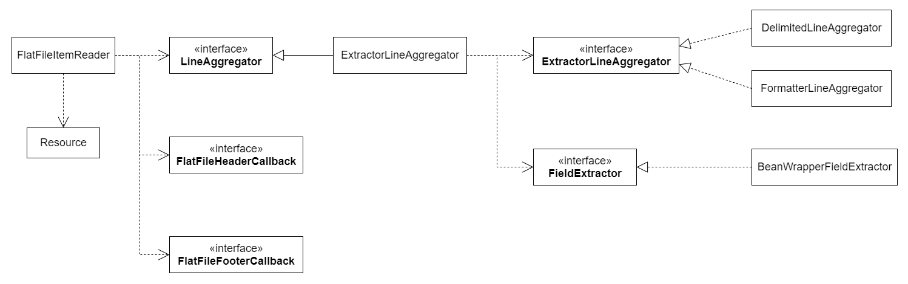

# 07 - 讀取 csv 檔
上一章提到 Spring Batch 的讀取資料來源大致上可以分為三種，下面的將以讀取 csv 檔為例。最常用的讀取檔案的 ItemReader 是 FlatFileItemReader。FlatFile 是**扁平結構檔案** ( 也稱為矩陣結構檔案 )，是最常見的一種檔案型別。讀取時通常以一行 ( line ) 為一個單位，同一行資料的欄位支間可以用某種方式切割，例如常見的分號 `;`、逗號 `,`，或是索引 ( index ) 等等。與一般的 JSON、XML 檔案的差別在於他沒有一個特定的結構，所以在讀取的時候需要定義讀取及轉換的規則。

## 建立 FlatFileItemReader
Spring Batch 為檔案讀取提供了 FlatFileItemReader 類別，並提供一些方法用來讀取資料和轉換。在 FlatFileItemReader 中有2個主要的功能介面：Resource 及 LineMapper。 Resource 用於外部檔案讀取，例如：

```java
Resource resource = new FileSystemResource("resources/書單.csv"); 
```

那麼接下來，先建立一個 FlatFileItemReader。
```
spring.batch.springBatchPractice.job
  |--BCHBORED001JobConfig.java // 修改
spring.batch.springBatchPractice.listener
  |--BCHBORED001JobListener.java
  |--BCHBORED001ReaderListener.java // 新增
```
<br/>

* `BCHBORED001JobConfig.java`
```java
public class BCHBORED001JobConfig {

  /** JobBuilderFactory */
  @Autowired
  private JobBuilderFactory jobBuilderFactory;

  /** StepBuilderFactory */
  @Autowired
  private StepBuilderFactory stepBuilderFactory;

  /** 每批件數 */
  private static final int FETCH_SIZE = 10;

  @Bean
  public Job fileReaderJob(@Qualifier("fileReaderJob") Step step) {
      return jobBuilderFactory.get("fileReaderJob")
              .start(step)
              .listener(null)
              .build();
  }

  /**
   * 註冊 Step
   * @param itemReader
   * @param process
   * @param itemWriter
   * @param jpaTransactionManager
   * @return
   */
  @Bean("fileReaderStep")
  private Step fileReaderStep(ItemReader<BookInfoDto> itemReader, BCH001Processor process, ItemWriter<BsrResvResidual> itemWriter,
          JpaTransactionManager jpaTransactionManager) {
      return stepBuilderFactory.get("BCH001Step1")
              .transactionManager(jpaTransactionManager)
              .<BookInfoDto, BsrResvResidual> chunk(FETCH_SIZE)
              .reader(itemReader)
              .processor(process) 
              .faultTolerant()
              .skip(Exception.class)
              .skipLimit(Integer.MAX_VALUE)
              .writer(itemWriter)
              .listener(new BCHBORED001StepListener())
              .listener(new BCHBORED001ReaderListener())
              .build();
  }

  /**
   * 建立 FileReader
   * @return
   */
  @Bean
  public ItemReader<BookInfoDto> getItemReader() {
      return new FlatFileItemReaderBuilder<BookInfoDto>().name("fileReader")
              .resource(new ClassPathResource("/excel/書單.csv"))
              .linesToSkip(1)
              .lineMapper(getBookInfoLineMapper())
              .build();
  }
}
```
在 `getItemReader()` 方法中，使用 FlatFileItemReaderBuilder 來建立我們要的 FlatFileItemReade，並透過 `name()` 方法來為 FlatFileItemReader 實例命名。

#### FlatFileItemReader 部分屬性
| 方法名稱 | 說明 |
|-- |-- |
| `resource()` | 指定外部資源檔按位置。 |
| `linesToSkip()` | 可以設定要跳過不讀取的行數。 |
| `lineMapper()` | 指定檔案讀取及轉換的規則。 |
| `comments()` | 若檔案中有註解，可以指定註解字首，並過濾內容。 |
| `encoding()` | 指定檔案編碼格式，預設為 `Charset.defaultCharset()`。 |
| `skippedLinesCallback()` | 當有設定 `linesToSkip` 時，當執行時每跳過一行，可傳入被跳過的內容並執行指定方法。 |

再來，要使用 LineMapper 物件來設定檔按欄位的分割以及轉換的規則。

## LineMapper
LineMapper 這個介面的功能是將字串轉換為物件。主要是將讀入的一行資料進行轉換，再轉換的過程中 LineMapper 實例會呼叫 `mapLine()` 方法來處理資料轉換。

```java
public interface LineMapper<T> {

	/**
	 * Implementations must implement this method to map the provided line to 
	 * the parameter type T.  The line number represents the number of lines
	 * into a file the current line resides.
	 * 
	 * @param line to be mapped
	 * @param lineNumber of the current line
	 * @return mapped object of type T
	 * @throws Exception if error occurred while parsing.
	 */
	T mapLine(String line, int lineNumber) throws Exception;
}
```
因為涉及到資料轉換，要從一行 ( line ) 轉換為一個 FieldSet ( 像是 ResultSet 的概念 )，一個欄位是一個 column，必須傳入兩個介面的物件實例給 LineMapper，分別是 **LineTokenizer** 及 **FieldSetMapper**。
<br/>

#### LineTokenizer
此介面功能主要是用來將一行資料分割為不同的資料欄位 ( FieldSet )，所以在使用 LineMapper 時也要實作此介面。LineTokenizer 介面可以由以下三種類別實現：<br/>

1. DelimitedLineTokenizer：利用分隔符號將資料轉換為 FieldSet，預設為逗號，也可以自行定義分隔符號。
<br/>
2. FixedLengthTokenizer：根據欄位的長度來解析出 FieldSet 結構，所以必須為記錄且定義欄位寬度。
<br/>
3. PatternMatchingCompositeLineTokenizer：自訂匹配機制來動態決定要使用哪一種 LineTokenizer。

在此範例中，使用 DelimitedLineTokenizer 實例，由於。

```java
// 1. 設定每一筆資料的欄位拆分規則，預設以逗號拆分
DelimitedLineTokenizer tokenizer = new DelimitedLineTokenizer();
```
<br/>

#### FieldSetMapper
FieldSetMapper 介面是將讀入併分割好的 FieldSet 轉換為程式面的物件。FieldSetMapper 通常跟 LineTokenizer 一起使用。轉換的過程會由一串 String &rarr; 切分為 FieldSet &rarr; 目標 Object。實現此界面的類別有 **DefaultLineMapper** 及 **BeanWrapperFieldSetMapper**。

1. DefaultLineMapper
在這個例子中我們使用的是 DefaultLineMapper。mapping 的方法大致可分為兩種：依照欄位順序或是指定欄位名稱，依欄位名稱對應。如果要依照欄位名稱對應，在上一步使用 LineTokenizer 時就要為拆分出來的字串依照順序命名，這樣在實例化 FieldSetMapper 的時候就可以用 `fieldSet.readString(columnName)` 的方式將指定的字串取出。
```java
/** Mapping 欄位名稱 */
private static final String[] MAPPER_FIELD = new String[] { "BookName", "Author", "Category", "Tags", 
  "Recommend", "Description", "Comment1", "Comment2", "UpdDate", "UpdName" };

...
...

/**
 * 建立 LineMapper
 */
private LineMapper<BookInfoDto> getBookInfoLineMapper() {
  DefaultLineMapper<BookInfoDto> bookInfoLineMapper = new DefaultLineMapper<>();

  // 1. 設定每一筆資料的欄位拆分規則
  DelimitedLineTokenizer tokenizer = new DelimitedLineTokenizer();

  // 2. 指定 fieldSet 對應邏輯
  FieldSetMapper<BookInfoDto> fieldSetMapper = fieldSet -> {
    BookInfoDto bookInfDto = new BookInfoDto();

    bookInfDto.setBookName(fieldSet.readString("BookName"));
    bookInfDto.setAuthor(fieldSet.readString("Author"));
    bookInfDto.setCategory(fieldSet.readString("Category"));
    bookInfDto.setTags(fieldSet.readString("Tags"));
    bookInfDto.setRecommend(fieldSet.readString("Recommend"));
    bookInfDto.setDescription(fieldSet.readString("Description"));
    bookInfDto.setComment1(fieldSet.readString("Comment1"));
    bookInfDto.setComment2(fieldSet.readString("Comment2"));
    bookInfDto.setUpdDate(fieldSet.readString("UpdDate"));
    bookInfDto.setUpdName(fieldSet.readString("UpdName"));

    return bookInfDto;
  };

  bookInfoLineMapper.setLineTokenizer(tokenizer);
  bookInfoLineMapper.setFieldSetMapper(fieldSetMapper);
  return bookInfoLineMapper;
}
```
整體的轉換順序大致如下圖：

<br/>

如果不指定欄位名稱，依照被逗號分隔後的 `fieldSet` 位置來進行 mapping，方法如下：
```java
FieldSetMapper<BookInfoDto> fieldSetMapper = fieldSet -> {
  BookInfoDto bookInfDto = new BookInfoDto();
  bookInfDto.setBookName(fieldSet.readString(0));
  bookInfDto.setAuthor(fieldSet.readString(1));
  bookInfDto.setCategory(fieldSet.readString(2));
  bookInfDto.setTags(fieldSet.readString(3));
  bookInfDto.setRecommend(fieldSet.readString(4));
  bookInfDto.setDescription(fieldSet.readString(5));
  bookInfDto.setComment1(fieldSet.readString(6));
  bookInfDto.setComment2(fieldSet.readString(7));
  bookInfDto.setUpdDate(fieldSet.readString(8));
  bookInfDto.setUpdName(fieldSet.readString(9));

  return bookInfDto;
};
```
<br/>

2. BeanWrapperFieldSetMapper
在轉換過程中可以將 FieldSet 的 `names` 屬性與目標物件的 field 繫結，就可以直接使用映射轉換。目標物件的 field 名稱必須跟前面 LineTokenizer 設定的 `names` 一樣才可以轉換。
```java
/**
 * 建立 LineMapper
 */
private LineMapper<BookInfoDto> getBookInfoLineMapper() {
  DefaultLineMapper<BookInfoDto> bookInfoLineMapper = new DefaultLineMapper<>();

  // 1. 設定每一筆資料的欄位拆分規則
  DelimitedLineTokenizer tokenizer = new DelimitedLineTokenizer();

  // 2. 指定 fieldSet 對應邏輯
  BeanWrapperFieldSetMapper<BookInfoDto> fieldSetMapper = new BeanWrapperFieldSetMapper<>();
  fieldSetMapper.setTargetType(BookInfoDto.class);

  bookInfoLineMapper.setLineTokenizer(tokenizer);
  bookInfoLineMapper.setFieldSetMapper(fieldSetMapper);
  return bookInfoLineMapper;
}

```
<br/>

## 完整檔案
完整檔案如下：
```java
public class BCHBORED001JobConfig {

    /** JobBuilderFactory */
    @Autowired
    private JobBuilderFactory jobBuilderFactory;

    /** StepBuilderFactory */
    @Autowired
    private StepBuilderFactory stepBuilderFactory;

    /** Mapping 欄位名稱 */
    private static final String[] MAPPER_FIELD = new String[] { "BookName", "Author", "Category", "Tags", "Recommend", "Description", "Comment1",
            "Comment2", "UpdDate", "UpdName" };
    
    /** 每批件數 */
    private static final int FETCH_SIZE = 10;

    @Bean
    public Job fileReaderJob(@Qualifier("fileReaderJob") Step step) {
        return jobBuilderFactory.get("fileReaderJob")
                .start(step)
                .listener(null)
                .build();
    }

    /**
     * 註冊 Step
     * @param itemReader
     * @param process
     * @param itemWriter
     * @param jpaTransactionManager
     * @return
     */
    @Bean("fileReaderStep")
    private Step fileReaderStep(ItemReader<BookInfoDto> itemReader, BCH001Processor process, ItemWriter<BsrResvResidual> itemWriter,
            JpaTransactionManager jpaTransactionManager) {
        return stepBuilderFactory.get("BCH001Step1")
                .transactionManager(jpaTransactionManager)
                .<BookInfoDto, BsrResvResidual> chunk(FETCH_SIZE)
                .reader(itemReader)
                .processor(process) 
                .faultTolerant()
                .skip(Exception.class)
                .skipLimit(Integer.MAX_VALUE)
                .writer(itemWriter)
                .listener(new BCHBORED001StepListener())
                .listener(new BCHBORED001ReaderListener())
                .build();
    }

    /**
     * 建立 FileReader
     * @return
     */
    @Bean
    public ItemReader<BookInfoDto> getItemReader() {
        return new FlatFileItemReaderBuilder<BookInfoDto>().name("fileReader")
                .resource(new ClassPathResource("/excel/書單.csv"))
                .linesToSkip(1)
                .lineMapper(getBookInfoLineMapper())
                .build();
    }

    /**
     * 建立 FileReader mapping 規則
     * @return
     */
    private LineMapper<BookInfoDto> getBookInfoLineMapper() {
        DefaultLineMapper<BookInfoDto> bookInfoLineMapper = new DefaultLineMapper<>();

        // 1. 設定每一筆資料的欄位拆分規則，預設以逗號拆分
        DelimitedLineTokenizer tokenizer = new DelimitedLineTokenizer();
        tokenizer.setNames(MAPPER_FIELD);

        // 2. 指定 fieldSet 對應邏輯
        FieldSetMapper<BookInfoDto> fieldSetMapper = fieldSet -> {
        BookInfoDto bookInfDto = new BookInfoDto();
        bookInfDto.setBookName(fieldSet.readString("BookName"));
        bookInfDto.setAuthor(fieldSet.readString("Author"));
        bookInfDto.setCategory(fieldSet.readString("Category"));
        bookInfDto.setTags(fieldSet.readString("Tags"));
        bookInfDto.setRecommend(fieldSet.readString("Recommend"));
        bookInfDto.setDescription(fieldSet.readString("Description"));
        bookInfDto.setComment1(fieldSet.readString("Comment1"));
        bookInfDto.setComment2(fieldSet.readString("Comment2"));
        bookInfDto.setUpdDate(fieldSet.readString("UpdDate"));
        bookInfDto.setUpdName(fieldSet.readString("UpdName"));

        return bookInfDto;
      };
        
      bookInfoLineMapper.setLineTokenizer(tokenizer);
      bookInfoLineMapper.setFieldSetMapper(fieldSetMapper);
      return bookInfoLineMapper;
    }
}
```

## 參考
* https://stackoverflow.com/questions/66234905/reading-csv-data-in-spring-batch-creating-a-custom-linemapper
* https://www.itread01.com/content/1562677203.html
