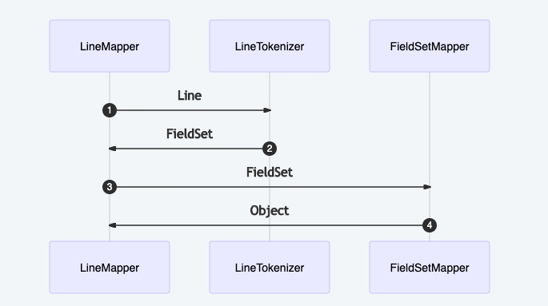

# 16 - 讀取 csv 檔
前面有提到 Spring Batch 的讀取資料來源大致上可以分為三種，下面的例子將以讀取 csv 檔為例。最常用的讀取檔案的 ItemReader 是 FlatFileItemReader。FlatFile 是**扁平結構檔案** ( 也稱為矩陣結構檔案 )，是最常見的一種檔案型別。與 JSON、XML 檔案的差別在於 FlatFile 沒有一個特定的結構，所以在讀取的時候需要定義讀取及轉換的規則。

一般來說，平面文件可以分成兩種切割方式：
1. `delimited`：以某個特殊符號或規則劃分
2. `fixed length`：以長度劃分

讀取時通常以一行 ( line ) 為一個單位，同一行資料的欄位之間可以用某種方式切割。如果是 `delimited` 的話，比較常見的切割符號有分號 `;`、逗號 `,` 等等。若是以長度切分的話，就要在程式內設定每個欄位的長度。

## FieldSet
在 Spring Batch 中，不管是用於 input 或是 output，有一個很重要的類別 `FieldSet`。`FieldSet` 是 Spring Batch 中的一個抽象概念，主要是用來 binding 文件資源。

> A FieldSet is Spring Batch’s abstraction for enabling the binding of fields from a file resource.

講的簡單一點，他的概念有點類似於 JDBC 的 `ResultSet`。而 `FieldSet` 需要傳入一個 String 陣列的參數，在來也可以另外設定每個 `Field` 的名稱，就可以透過索引 ( index ) 或名稱 ( names ) 的 pattern 來取得對應的 `Feild`。例子如下：

```java
String[] tokens = new String[]{"foo", "1", "true"};
FieldSet fs = new DefaultFieldSet(tokens);

// 讀取資料
String name = fs.readString(0);
int value = fs.readInt(1);
boolean booleanValue = fs.readBoolean(2);
```
`FieldSet` 可以指定讀取出來的物件型別，上面的例子就分別用 `readString()`、`readInt()` 跟 `readBoolean()` 來讀取一個 `FieldSet` 中的內容，並以 index 指定讀取陣列內的第幾個元素。

以下提供幾個 `FieldSet` 的方法：<br/>


## FlatFileItemReader
Spring Batch 為檔案讀取提供了 FlatFileItemReader 類別，並提供一些方法用來讀取資料和轉換。在 FlatFileItemReader 中有 2 個主要的功能介面：[Resource](https://docs.spring.io/spring-framework/docs/current/reference/html/core.html#resources) 及 LineMapper。 Resource 用於外部檔案讀取，例如：

```java
Resource resource = new FileSystemResource("resources/書單.csv"); 
```

他們之間的關係大致如下圖：<br/>


#### FlatFileItemReader 部分屬性
| 方法名稱 | 說明 |
|-- |-- |
| `resource()` | 指定外部資源檔按位置。 |
| `linesToSkip()` | 可以設定要跳過不讀取的行數。 |
| `lineMapper()` | 指定檔案讀取及轉換的規則。 |
| `comments()` | 若檔案中有註解，可以指定註解字首，並過濾內容。 |
| `encoding()` | 指定檔案編碼格式，預設為 `Charset.defaultCharset()`。 |
| `skippedLinesCallback()` | 當有設定 `linesToSkip` 時，當執行時每跳過一行，可傳入被跳過的內容並執行指定方法。 |

再來，要使用 LineMapper 物件來設定檔按欄位的分割以及轉換的規則。

## LineMapper
LineMapper 這個介面的功能是將字串轉換為物件。主要是將讀入的一行資料進行轉換，轉換過程中 LineMapper 實例會呼叫 `mapLine()` 方法來處理，而我們也不需要知道 Spring Batch 怎麼去獲取一行資料的。

```java
public interface LineMapper<T> {

	/**
	 * Implementations must implement this method to map the provided line to 
	 * the parameter type T.  The line number represents the number of lines
	 * into a file the current line resides.
	 * 
	 * @param line to be mapped
	 * @param lineNumber of the current line
	 * @return mapped object of type T
	 * @throws Exception if error occurred while parsing.
	 */
	T mapLine(String line, int lineNumber) throws Exception;
}
```

Spring Batch 提供一些用來處理不同狀況、實作 `LineMapper` 的類別 ( 如下表 )。
| Class | 說明 |
| --- | --- |
| `DefaultLineMapper` | 預設用來將標記化後的 lines 的內容映射到程式面的 Object 中的實例。
| `JsonLineMapper` | 支援將 JOSN 格式數據的提取，並將資料 mapping 到指定的格式中。此類別是基於 jackson-mapper-asl.jar 文件內的規範實現的，相關可以到 http://jackson.codehaus.org/ 網站上查詢。
| `PassThroughLineMapper` | 提供原始的資料字串，而非映射到程式面的物件中。
| `PatternMatchingCompositeLineMapper` | Parses heterogeneous record lines. For each line type, a line tokenizer and a fieldset mapper must be configured.
<br/>

`LineMapper` 最常用的實現類別是 `DefaultLineMapper`，它會分成兩個階段來處理讀入的資料：
1. 使用 `LineTokenizer` 解析並將來源檔案提取成一行一行字段 ( lines )
2. 來源檔案中的一行資訊會被解析成一個 `FieldSet` 物件傳入，接下來就要使用 `FieldSetMapper` 物件來建立轉換目標物件 ( Data Object )，並將 `FieldSet` 中的值對應到目標物件中。
<br/>

過程如下：<br/>

<br/>

## LineTokenizer
此介面功能主要是用來將一行資料轉換為一個 `FieldSet` 物件，所以在使用 LineMapper 時也要實作此介面。
```java
public interface LineTokenizer {
	
	/**
	 * Yields the tokens resulting from the splitting of the supplied
	 * <code>line</code>.
	 * 
	 * @param line the line to be tokenized (can be <code>null</code>)
	 * 
	 * @return the resulting tokens
	 */
	FieldSet tokenize(String line);
}
```


`LineTokenizer` 介面可以由以下三種類別實現：<br/>

1. `DelimitedLineTokenizer`：利用分隔符號將資料轉換為 `FieldSet`，預設為逗號，也可以自行定義分隔符號。

2. `FixedLengthTokenizer`：根據欄位的長度來解析出 `FieldSet` 結構，所以必須為記錄且定義欄位寬度。

3. `PatternMatchingCompositeLineTokenizer`：自訂匹配機制來動態決定要使用哪一種 `LineTokenizer`。

在此範例中，使用 `DelimitedLineTokenizer` 實例，由於預設是逗號，所以只要 `new` 出 `DelimitedLineTokenizer` 物件即可。

```java
// 1. 設定每一筆資料的欄位拆分規則，預設以逗號拆分
DelimitedLineTokenizer tokenizer = new DelimitedLineTokenizer();
tokenizer.setDelimiter("#"); // 設定其他劃分符號
```
<br/>

## FieldSetMapper
FieldSetMapper 介面是將 FieldSet 轉換為程式面物件的介面。FieldSetMapper 通常跟 LineTokenizer 一起使用。轉換的過程會由一串 String &rarr; 切分為 FieldSet &rarr; 目標 Object。實現此界面的類別有 `DefaultLineMapper`、`BeanWrapperFieldSetMapper` 及 `PassThroughFieldSetMapper` 等等。經過 `FieldSetMapper` 轉換後會回傳目標物件。
```java
public interface FieldSetMapper<T> {
	
	/**
	 * Method used to map data obtained from a {@link FieldSet} into an object.
	 * 
	 * @param fieldSet the {@link FieldSet} to map
	 * @return the populated object
	 * @throws BindException if there is a problem with the binding
	 */
	T mapFieldSet(FieldSet fieldSet) throws BindException;
}
```

通常 mapping 的方式有 2 種：
1. 依欄位順序
2. 依欄位名稱
<br/>

#### DefaultLineMapper
如果要依照欄位名稱對應，在上一步使用 LineTokenizer 時就要為拆分出來的字串依照順序命名，這樣在實例化 FieldSetMapper 的時候就可以用 `fieldSet.readString(columnName)` 的方式將指定的字串取出。
```java
/** Mapping 欄位名稱 */
private static final String[] MAPPER_FIELD = new String[] { "BookName", "Author", "Category", "Tags", 
  "Recommend", "Description", "Comment1", "Comment2", "UpdDate", "UpdName" };

...
...

/**
 * 建立 LineMapper
 */
private LineMapper<BookInfoDto> getBookInfoLineMapper() {
  DefaultLineMapper<BookInfoDto> bookInfoLineMapper = new DefaultLineMapper<>();

  // 1. 設定每一筆資料的欄位拆分規則
  DelimitedLineTokenizer tokenizer = new DelimitedLineTokenizer();
  tokenizer.setNames(MAPPER_FIELD); // 設定每個欄位名稱，有順序性

  // 2. 指定 fieldSet 對應邏輯
  FieldSetMapper<BookInfoDto> fieldSetMapper = fieldSet -> {
    BookInfoDto bookInfDto = new BookInfoDto();

    bookInfDto.setBookName(fieldSet.readString("BookName"));
    bookInfDto.setAuthor(fieldSet.readString("Author"));
    bookInfDto.setCategory(fieldSet.readString("Category"));
    bookInfDto.setTags(fieldSet.readString("Tags"));
    bookInfDto.setRecommend(fieldSet.readString("Recommend"));
    bookInfDto.setDescription(fieldSet.readString("Description"));
    bookInfDto.setComment1(fieldSet.readString("Comment1"));
    bookInfDto.setComment2(fieldSet.readString("Comment2"));
    bookInfDto.setUpdDate(fieldSet.readString("UpdDate"));
    bookInfDto.setUpdName(fieldSet.readString("UpdName"));

    return bookInfDto;
  };

  bookInfoLineMapper.setLineTokenizer(tokenizer);
  bookInfoLineMapper.setFieldSetMapper(fieldSetMapper);
  return bookInfoLineMapper;
}
```
設定完欄位名稱後，實做 `FieldSetMapper` 介面，呼叫 `FieldSet` 物件的 `readXXX()` 方法就可以依照欄位名稱取得相對應的物件內容。

整體的轉換順序大致如下圖：<br/>

<br/>

如果不指定欄位名稱，依照被逗號分隔後的 `fieldSet` 位置來進行 mapping，方法如下：
```java
FieldSetMapper<BookInfoDto> fieldSetMapper = fieldSet -> {
  BookInfoDto bookInfDto = new BookInfoDto();
  bookInfDto.setBookName(fieldSet.readString(0));
  bookInfDto.setAuthor(fieldSet.readString(1));
  bookInfDto.setCategory(fieldSet.readString(2));
  bookInfDto.setTags(fieldSet.readString(3));
  bookInfDto.setRecommend(fieldSet.readString(4));
  bookInfDto.setDescription(fieldSet.readString(5));
  bookInfDto.setComment1(fieldSet.readString(6));
  bookInfDto.setComment2(fieldSet.readString(7));
  bookInfDto.setUpdDate(fieldSet.readString(8));
  bookInfDto.setUpdName(fieldSet.readString(9));

  return bookInfDto;
};
```
<br/>

#### BeanWrapperFieldSetMapper
在轉換過程中可以將 `FieldSet` 的 `names` 屬性與目標物件的 `field` 繫結，就可以直接使用映射轉換。目標物件的 `field` 名稱必須跟前面 `LineTokenizer` 設定的 `names` 一樣才可以轉換 ( 目前看起來大小寫不一樣好像沒有關係 )。

> [BeanWrapperFieldSetMapper Source Code](https://github.com/spring-projects/spring-batch/blob/main/spring-batch-infrastructure/src/main/java/org/springframework/batch/item/file/mapping/BeanWrapperFieldSetMapper.java)

```java
/**
 * 建立 LineMapper
 */
private LineMapper<BookInfoDto> getBookInfoLineMapper() {
  DefaultLineMapper<BookInfoDto> bookInfoLineMapper = new DefaultLineMapper<>();

  // 1. 設定每一筆資料的欄位拆分規則
  DelimitedLineTokenizer tokenizer = new DelimitedLineTokenizer();

  // 2. 指定 fieldSet 對應邏輯
  BeanWrapperFieldSetMapper<BookInfoDto> fieldSetMapper = new BeanWrapperFieldSetMapper<>();
  fieldSetMapper.setTargetType(BookInfoDto.class);

  bookInfoLineMapper.setLineTokenizer(tokenizer);
  bookInfoLineMapper.setFieldSetMapper(fieldSetMapper);
  return bookInfoLineMapper;
}

```
<br/>


## 建立 FlatFileReader
最後，根據上面的一些依賴，建立 FlatFileItemReader。
```
spring.batch.springBatchPractice.job
  |--BCHBORED001JobConfig.java // 修改
spring.batch.springBatchPractice.listener
  |--BCHBORED001JobListener.java
  |--BCHBORED001ReaderListener.java // 新增
```
<br/>

* `BCHBORED001JobConfig.java`
```java
@Configuration
public class FileReaderJobConfig {

  /** JobBuilderFactory */
  @Autowired
  private JobBuilderFactory jobBuilderFactory;

  /** StepBuilderFactory */
  @Autowired
  private StepBuilderFactory stepBuilderFactory;

  /** CarRepo */
  @Autowired
  private CarRepo carRepo;

  /** Mapping 欄位名稱 */
  private static final String[] MAPPER_FIELD = new String[] { "Manufacturer", "Type", "MinPrice", "Price" };

  /** 每批件數 */
  private static final int FETCH_SIZE = 1;

  /**
    * 註冊 Job
    * @param step
    * @return
    */
  @Bean("File001Job")
  public Job fileReaderJob(@Qualifier("File001Step") Step step) {
    return jobBuilderFactory.get("File001Job")
        .start(step)
        .listener(new File001JobListener())
        .build();
  }

  /**
   * 註冊 Step
   * @param itemReader
   * @param itemWriter
   * @param jpaTransactionManager
   * @return
   */
  @Bean("File001Step")
  public Step fileReaderStep(@Qualifier("File001FileReader") ItemReader<Car> itemReader, @Qualifier("File001JpaWriter") ItemWriter<Car> itemWriter,
      JpaTransactionManager jpaTransactionManager) {

    return stepBuilderFactory.get("File001Step")
      .transactionManager(jpaTransactionManager)
      .<Car, Car>chunk(FETCH_SIZE)
      .reader(itemReader)
      .faultTolerant()
      .skip(Exception.class)
      .skipLimit(Integer.MAX_VALUE)
      .writer(itemWriter)
      .listener(new File001StepListener())
      .listener(new File001ReaderListener())
      .listener(new File001WriterListener())
      .build();
  }

  /**
    * 建立 FileReader
    * @return
    */
  @Bean("File001FileReader")
  public ItemReader<Car> getItemReader() {
    return new FlatFileItemReaderBuilder<Car>().name("File001FileReader")
      .encoding("UTF-8")
      // .resource(new FileSystemResource("D:/Cars.csv"))
      .resource(new ClassPathResource("csv/Cars.csv"))
      .linesToSkip(1)
      .lineMapper(getCarLineMapper())
      .build();
  }

  /**
    * 建立 FileReader mapping 規則
    * @return
    */
  private LineMapper<Car> getCarLineMapper() {
    DefaultLineMapper<Car> bookInfoLineMapper = new DefaultLineMapper<>();

    // 1. 設定每一筆資料的欄位拆分規則，預設以逗號拆分
    DelimitedLineTokenizer tokenizer = new DelimitedLineTokenizer();
    tokenizer.setNames(MAPPER_FIELD);

    // 2. 設定資料轉換到程式面的規則
    BeanWrapperFieldSetMapper<Car> fieldSetMapper = new
    BeanWrapperFieldSetMapper<>();
    fieldSetMapper.setTargetType(Car.class);

    bookInfoLineMapper.setLineTokenizer(tokenizer);
    bookInfoLineMapper.setFieldSetMapper(fieldSetMapper);
    return bookInfoLineMapper;
  }
}
```

在 `getItemReader()` 方法中，使用 FlatFileItemReaderBuilder 來建立我們要的 FlatFileItemReade，並透過 `name()` 方法來為 FlatFileItemReader 實例命名。`linesToSkip()` 方法用來跳過表頭。

再來，依照檔案存放的位置使用不同的協定讀取檔案，`ClassPathResource` 只能讀到專案內預設路徑下的東西，使用 `FileSystemResource` 則可以讀取本機內的路徑。`lineMapper()` 方法中我們另外寫了一個 `private` 方法 `getCarLineMapper()` 用來產生上面提到的 `LineMapper`、`LineTokenizer` 以及 `FieldSetMapper`，最後回傳 `LineMapper` 物件回傳。

跟 FileItemWriter 一樣，我們可以將這個過程再簡化：
```java
...
@Bean("File001FileReader")
public ItemReader<Car> getItemReader(@Value("${filePath}")
String filePath) {
return new FlatFileItemReaderBuilder<Car>().name("File001FileReader")
	.encoding("UTF-8")
	// .resource(new FileSystemResource("D:/Cars.csv"))
        .resource(new ClassPathResource("csv/Cars.csv"))
	.linesToSkip(1)
	.delimited() // 使用 DelimitedLineTokenizer
	.names(MAPPER_FIELD) // 設定對應欄位
	.fieldSetMapper(new BeanWrapperFieldSetMapper<Car>()) // 設定
	.build();
}
...
```

## 參考
* https://stackoverflow.com/questions/66234905/reading-csv-data-in-spring-batch-creating-a-custom-linemapper
* https://www.itread01.com/content/1562677203.html
* https://www.petrikainulainen.net/programming/spring-framework/spring-batch-tutorial-reading-information-from-a-file/
* https://www.dineshonjava.com/spring-batch-read-from-csv-and-write-to-relational-db/
* https://livebook.manning.com/book/spring-batch-in-action/chapter-5/65
